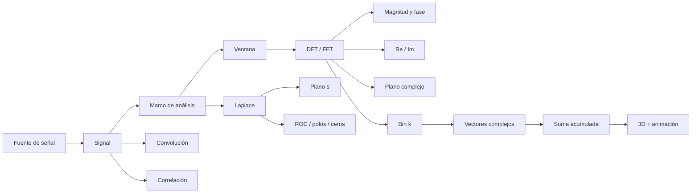

# SigTeach DSP Explorer


**SigTeach DSP Explorer** es una aplicación didáctica interactiva para cursos de
**Procesamiento Digital de Señales (DSP)**. Reinterpreta la idea del SigTeach
clásico con una interfaz moderna, multiplataforma y basada en Python.

El objetivo no es solamente "dibujar una FFT", sino hacer visible la estructura
matemática de las transformadas. La DFT se presenta como suma de vectores complejos y la
transformada de Laplace como una familia de integrales de Fourier ponderadas por
exponenciales reales. Ambas transformadas pueden explorarse en el plano complejo,
en 3D y mediante animaciones de acumulación muestra a muestra.

## Funcionalidades

- Banco de señales: seno, coseno, dos tonos, impulso, tren de impulsos, cuadrada,
  chirp, ruido y vocal `/a/` sintética.
- Carga de CSV de una columna.
- Carga opcional de WAV.
- Definición manual de muestras.
- Selección de `fs`, inicio de marco, longitud `L`, `NFFT` y ventana.
- DFT en magnitud/fase y forma rectangular Re/Im.
- Espectro unilateral, bilateral centrado y eje `0 … fs`.
- Visualización en plano complejo y forma polar.
- Exploración de un bin `k` particular.
- Representación 3D de los vectores complejos y de su suma acumulada.
- Animación del cálculo de `X[k]`.
- Transformada de Laplace numérica sobre el plano `s = σ + jω`.
- Heatmaps de magnitud/fase y superficie 3D de `|X(s)|`.
- Exploración paso a paso de `x(t)e^{-σt}e^{-jωt}` e integral compleja acumulada.
- Casos analíticos clásicos con polos, ceros y región de convergencia (ROC).
- Relación visual entre Laplace y Fourier a través del corte `σ = 0`.
- Comparación de ventanas y efecto de `NFFT`.
- Convolución visual y numérica, incluyendo `flip + shift + multiply + sum`.
- Autocorrelación y correlación cruzada.
- Pruebas unitarias de DFT, FFT, amplitud, operaciones y mecánica compleja.

## Diseño conceptual



## Instalación rápida

Requiere **Python 3.10 o superior**.

### Windows

```powershell
python -m venv .venv
.venv\Scripts\activate
python -m pip install --upgrade pip
pip install -r requirements.txt
streamlit run app.py
```

También puedes ejecutar:

```powershell
run_windows.bat
```

### Linux/macOS

```bash
python3 -m venv .venv
source .venv/bin/activate
python -m pip install --upgrade pip
pip install -r requirements.txt
streamlit run app.py
```

o:

```bash
chmod +x run_unix.sh
./run_unix.sh
```

## Pruebas

```bash
pip install -r requirements-dev.txt
pytest
```

## Organización

```text
SigTeach_DSP/
├── app.py
├── src/sigteach/
│   ├── signals/
│   ├── processing/        # dft.py, laplace.py, operations.py
│   ├── visualization/     # plots.py, mechanics.py, laplace.py
│   └── ui/
├── tests/
├── docs/
├── examples/
├── .streamlit/
├── .github/workflows/
├── pyproject.toml
└── requirements*.txt
```

## Decisiones didácticas

1. **DFT directa y FFT se separan conceptualmente.** La app usa FFT para
   interactividad, pero conserva una DFT matricial `O(N²)` para enseñanza.
2. **Zero-padding no crea resolución física.** Reduce el paso de la grilla
   `fs/NFFT`, pero no reemplaza una observación temporal más larga.
3. **La fase se oculta en bins casi nulos**, donde no es numéricamente estable.
4. **La amplitud compensa la ganancia coherente de la ventana**.
5. **La vista 3D implementa literalmente la suma compleja** de un bin DFT.
6. **Laplace se interpreta como ponderación + rotación + integración:** `e^{-σt}` controla crecimiento/decaimiento y `e^{-jωt}` la rotación compleja.
7. **La ROC se enseña con ejemplos analíticos infinitos.** Un registro temporal finito tiene transformada numérica finita para todo `s` finito y, por sí solo, no reproduce la convergencia asintótica de una señal infinita.

## Material docente

- [`docs/TEACHING_GUIDE.md`](docs/TEACHING_GUIDE.md)
- [`docs/LAPLACE_GUIDE.md`](docs/LAPLACE_GUIDE.md)
- [`docs/MATHEMATICAL_NOTES.md`](docs/MATHEMATICAL_NOTES.md)
- [`docs/ARCHITECTURE.md`](docs/ARCHITECTURE.md)

## Licencia

MIT. Ver [`LICENSE`](LICENSE).
