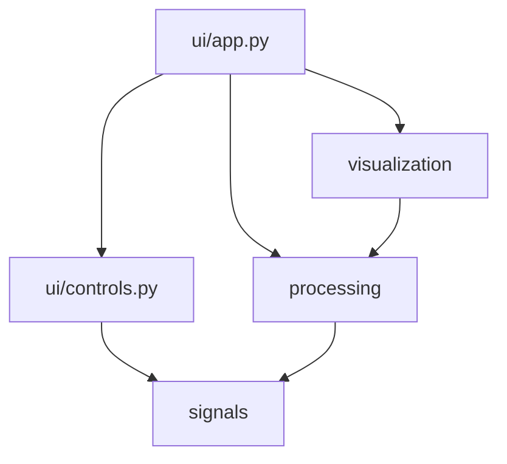

# Arquitectura de SigTeach DSP Explorer

La arquitectura separa cuatro responsabilidades: señales, procesamiento,
visualización e interfaz.

## `signals/`
- `model.py`: contenedor `Signal`.
- `bank.py`: banco de señales generadas.
- `io.py`: CSV, WAV y muestras manuales.

## `processing/`
- `dft.py`: FFT, DFT directa, ventanas y espectros.
- `laplace.py`: evaluación numérica en un punto y en el plano s, pares analíticos y ROC.
- `operations.py`: convolución, correlación y paso de convolución.

## `visualization/`
- `plots.py`: gráficos Plotly generales.
- `laplace.py`: plano s, superficies 3D, integración acumulada y ROC.
- `mechanics.py`: kernel complejo, suma acumulada, 3D y animación.

## `ui/`
Es la única capa dependiente de Streamlit.

## Extensión

Para agregar una señal:
1. añadirla a `BANK_SIGNAL_NAMES`;
2. implementarla en `generate_bank_signal`;
3. incorporar sus controles.

Para agregar una operación:
1. crear una función pura en `processing/`;
2. escribir pruebas;
3. crear la figura correspondiente;
4. integrarla en `ui/app.py`.
